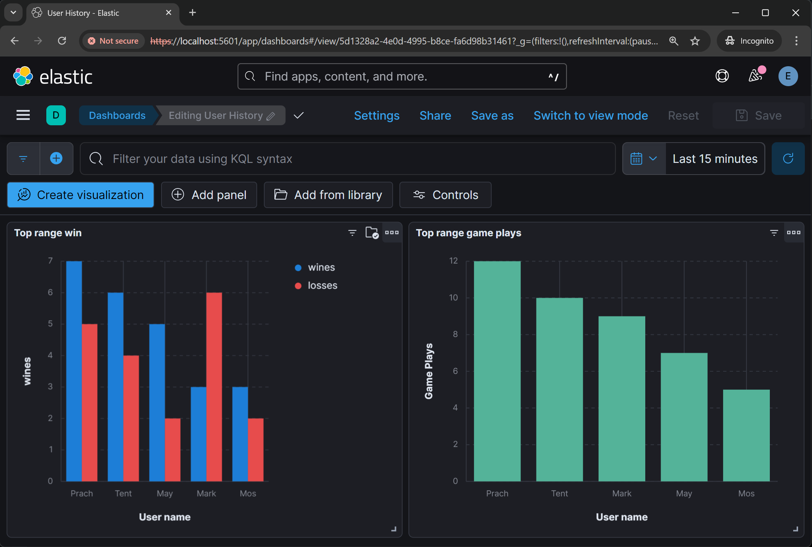

# ELK-Learn-Devops
## 📖Description
> Using Docker compose for testing ELK stack (Elasticsearch, Logstash, Kibana). for monitoring Django Backend as microservices.

## Previews

|  <br> <center>**Kibana Page**</center> |  <br> <center>**Kibana Page**</center> |
| :-: | :-: |

## 🛠️Built with
[](https://skillicons.dev)

## 📝Usage
- run server
  ```shell
  make
  ```
- down server
  ```shell
  make down
  ```

## 📌How it work

<p align="center">
  
</p>

### ELK services
- **Elasticsearch**: A NoSQL database that stores JSON data, optimized for fast searching and data analysis.
- **Logstash**: Ingests data from various sources, transforms it into JSON, and sends it to Elasticsearch.
- **Kibana**: Visualizes data from Elasticsearch, creating graphs, dashboards, and maps for analysis.

## ⚙️Setting
### Django Backend-service
At `settings.py` file config LOGGING for send output log into Logstash.
```python
LOGGING = {
  'handlers': {
    'logstash': {
      'host': 'logstash',
      'port': 5044,
    },
    ...
  },
}
```
### Logstash
At `logstash.conf` file. Config them to take input from TCP protocol and use `jdbc` library to query data from database.
```conf
input {
  tcp {
    port => 5044
    codec => json
  }
  jdbc {
    # config connnection to database service
  }
}

output {
  elasticsearch {
    # config connection to elasticsearch
  }
}

```

### Kibana
Login Kibana on the browser
```
username: elastic
password: es1234
```

On Kibana browser, We can draw graph or adjust table for logging in Data View. And We can export the Data View for use it in other projects.